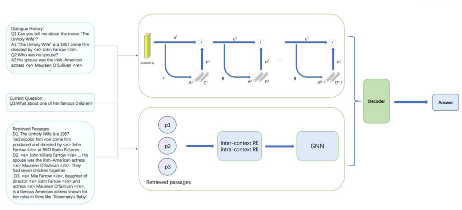

# Conv-REANO: Adapting Knowledge-Augmented Readers for Conversational QA with Memory Networks and Contrastive Learning

This repository contains the PyTorch implementation of **Conv-REANO**, a conversational extension of the REANO framework for retrieval-augmented open-domain question answering.

REANO dynamically constructs knowledge graphs from retrieved passages and uses graph reasoning to support answer generation. However, the original REANO reader is mainly designed for single-turn questions and does not explicitly model dialogue history. This limits its applicability to conversational question answering, where the current question may depend on previous turns through coreference, ellipsis, or other context-dependent expressions.

Conv-REANO addresses this limitation by adding a conversational context stream to the REANO reader. The model introduces:

- an end-to-end memory network (MemN2N) to encode and retrieve useful information from dialogue history;
- a contrastive learning objective to encourage more structured dialogue-aware turn representations;
- a late-fusion decoder input that combines REANO factual representations with the memory-based conversational context representation.

## Overview

Conv-REANO keeps the original REANO factual reasoning pipeline and extends it with a lightweight conversational module.

The factual knowledge stream follows REANO: retrieved passages are encoded, entities and relations are used to construct a dynamic knowledge graph, and graph reasoning is applied to select answer-relevant triples. These triples are converted into textual knowledge and fused with the passage representations for generation.

The conversational context stream uses MemN2N to represent pseudo-history or dialogue history as memory slots. Given the current question, the memory network attends to these slots and produces a compact context vector. This vector is concatenated with the REANO factual hidden states before decoding.

<figure style="text-align: center;">
  
  <figcaption>Overall architecture of Conv-REANO.</figcaption>
</figure>

## Repository Structure

```text
.
├── checkpoint/
│   └── default_experiment/
├── figures/
│   └── conv_reano.png
├── relation_extraction/
│   └── scripts and utilities for relation extraction
├── src/
│   ├── fid.py
│   ├── mem2n.py
│   └── model components
├── main.py
├── task.sh
├── requirements.txt
└── README.md
```

## Preprocessing

Conv-REANO uses the same preprocessing pipeline as the original REANO repository. Please follow the preprocessing instructions in the REANO README to prepare entity annotations, relation triples, and graph-related files.

The training and evaluation scripts expect processed files such as:

- `*_with_relevant_triples_wounkrel.pkl`
- `relation2id.pkl`
- `relationid2name.pkl`
- `relation_t5base_embeddings.pkl`

For the experiments in this repository, 2WikiMultiHopQA is used as the base dataset. Since it is not a native conversational QA dataset, the current implementation constructs pseudo-history from sampled question-answer pairs and feeds it to the memory network.

## Running

Install dependencies:

```bash
pip install -r requirements.txt
```

Run the default script:

```bash
bash task.sh
```

The current `task.sh` is configured for evaluation because it includes `--test_only` and `--saved_checkpoint_path`. Before running, update the paths in `task.sh` to match your local data and checkpoint locations:

- `--train_data`
- `--eval_data`
- `--test_data`
- `--relation2id`
- `--relationid2name`
- `--init_relation_embedding`
- `--saved_checkpoint_path`
- `--checkpoint_dir`

To train from scratch or continue training, remove `--test_only` and adjust `--saved_checkpoint_path` as needed.

Useful Conv-REANO-specific arguments include:

- `--memory_size`: number of memory slots used for pseudo-history;
- `--sentence_size`: maximum token length of each memory sentence.

## Implementation Notes

The main changes relative to REANO are:

- `src/mem2n.py`: implements the end-to-end memory network;
- `src/fid.py`: integrates MemN2N with the REANO reader, fuses memory output with factual hidden states before decoding, and adds the contrastive learning objective;
- `src/datasets.py`: builds memory inputs for pseudo-history and provides dialogue identifiers used by the contrastive loss.

The current implementation is intended as an exploratory conversational extension of REANO. For native conversational QA datasets, the pseudo-history construction should be replaced with real dialogue history.

## Acknowledgements

This repository is built upon the original REANO implementation, which itself is based on Fusion-in-Decoder and DocuNet. We thank the authors of REANO, FiD, and DocuNet for making their code and resources publicly available.

## Contact

For questions about this repository, please contact:

3230060019@i.smu.edu.cn
